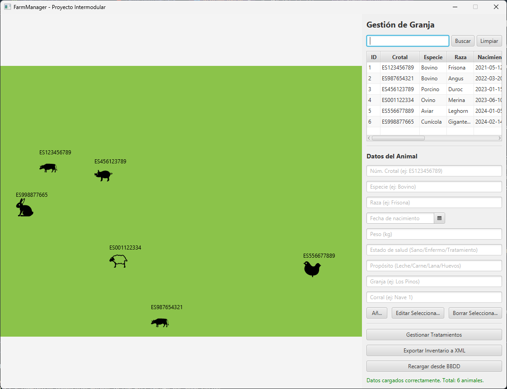

# FarmManager - Proyecto Intermodular DAM

FarmManager es una aplicación de escritorio desarrollada en **JavaFX** para la gestión de granjas. Permite realizar operaciones CRUD sobre una base de datos **MySQL**, visualizar animales de forma animada en un entorno gráfico, y exportar el inventario a un **XML validado con XSD**.



## Funcionalidades

- **Visualización animada** de los animales en el establo con emojis representativos por especie.
- **Operaciones CRUD** sobre animales (Crear, Leer, Actualizar, Borrar) usando la base de datos MySQL.
- **Búsqueda y filtrado** de animales por crotal, especie o raza.
- **Gestión de tratamientos médicos**: consulta el historial médico de cada animal.
- **Exportación del inventario a XML** con validación con esquema XSD.
- **Arquitectura MVC** con validación de datos con la interfaz `Validable`.

## Requisitos de instalación

- **Java 25+**
- **Maven 3.8+**.
- **Servidor MySQL 8** ejecutándose en `localhost:3306`.

## Pasos para compilar y ejecutar

El proyecto está configurado para generar un **Fat JAR** autoejecutable con Maven.

1. Iniciar servidor MySQL en `localhost:3306` si no está ya iniciado.

2. Construir el ejecutable(Asumiendo que Maven se encuentra en el directorio o PATH):
   ```powershell
   mvn clean package
   ```
4. Ejecutar la aplicación:
   ```powershell
   java -jar target/FarmManager-1.0-SNAPSHOT.jar
   ```
   También se puede ejecutar con:
   ```powershell
   mvn javafx:run
   ```

## Arquitectura y Ampliación de Programación (MPO)

El proyecto sigue principios de **Programación Orientada a Objetos (POO)** y está estructurado en capas de diseño **Modelo-Vista-Controlador (MVC)**:

- **Modelo (`farm.model`)**: Entidades `Animal`, `Granja`, `Corral` y `Tratamiento`. La clase `Animal` implementa la interfaz **`Validable`** para asegurar la validación de datos.
- **DAO (`farm.dao`)**: Aísla las operaciones CRUD (`AnimalDAO`, `GranjaDAO`, `CorralDAO`, `TratamientoDAO`) y la conexión JDBC (`DBConnection`).
- **Servicio (`farm.service`)**: Contiene la lógica, incluyendo búsqueda de animales y gestión de granjas y corrales al añadir o editar.
- **Controlador (`farm.controller`)**: Maneja la interfaz de JavaFX, la animación y las peticiones a la base de datos.


## Estructura del repositorio

```
FarmManager/
├── src/main/java/farm/          # Código fuente MVC
│   ├── model/                   # Entidades (Animal, Granja, Corral, Tratamiento)
│   ├── dao/                     # Acceso a datos (DAO + DBConnection)
│   ├── service/                 # Lógica de negocio
│   ├── controller/              # Controladores JavaFX
│   ├── App.java                 # Punto de entrada JavaFX
│   └── Launcher.java            # Lanzador del Fat JAR
├── src/main/resources/farm/     # Vistas FXML
├── sql/                         # Scripts SQL
│   ├── farm_db.sql              # Crea la base de datos si no existe e inserta datos de prueba
│   └── consultas.sql            # DQL, DML y VISTAS
├── xml/                         # Aquí se guardará el inventario XML al exportarlo
│   └── esquema.xsd              # Validador XSD
├── diagrama_ER.drawio           # Diagrama Entidad-Relación
├── pom.xml                      # Configuración de Maven
└── README.md                    # Este archivo
```

## Base de Datos

## Análisis de Datos
La aplicación tiene cuatro entidades:
- **Granjas:** Tiene un nombre, ubicación y propietario.
- **Corrales:** Lugares donde residen los animales. Pertenece a una granja y tiene capacidad máxima.
- **Animales:** Almacena la información de cada animal (número de crotal, especie, raza, fecha de nacimiento, peso, propósito y estado de salud), y está asignado obligatoriamente a un corral específico.
- **Tratamientos:** Registro de tratamientos aplicados a los animales.

### Relaciones
- **1 Granja posee N Corrales:** Un corral pertenece obligatoriamente a una sola granja, pero una granja puede tener múltiples corrales.
- **1 Corral alberga N Animales:** Un animal sólo puede estar y debe estar obligatoriamente en un corral, pero un corral puede tener varios animales. Si un corral se elimina, sus animales son eliminados a menos que se reubiquen antes.
- **1 Animal recibe N Tratamientos:** Un tratamiento médico se aplica a un solo animal, pero a lo largo de su vida un animal puede recibir múltiples tratamientos.

## Diagrama Entidad-Relación (E/R)
El diagrama es el archivo `diagrama_ER.drawio` ubicado en la raíz del proyecto.

## Modelo Relacional
A partir del diagrama E/R, se ha diseñado este esquema de tablas:

```
granjas(id PK AI, nombre VARCHAR(100) NN, ubicacion VARCHAR(150) NN, propietario VARCHAR(100) NN)

corrales(id PK AI, granja_id INT NN FK→granjas.id ON DELETE CASCADE, 
         nombre VARCHAR(50) NN, capacidad INT NN)

animales(id PK AI, corral_id INT NN FK→corrales.id ON DELETE CASCADE,
         numero_crotal VARCHAR(20) UNIQUE NN, especie VARCHAR(50) NN,
         raza VARCHAR(50) NN, fecha_nacimiento DATE NN,
         peso_kg DECIMAL(6,2) NN, estado_salud VARCHAR(50) DEFAULT 'Sano',
         proposito VARCHAR(50) NN)

tratamientos(id PK AI, animal_id INT NN FK→animales.id ON DELETE CASCADE,
             descripcion VARCHAR(200) NN, fecha DATE NN)
```

**Tabla: `granjas`**
- `id` (INT, PK, Auto): ID de la granja.
- `nombre` (VARCHAR, NOT NULL): Nombre de la granja.
- `ubicacion` (VARCHAR, NOT NULL): Ubicación.
- `propietario` (VARCHAR, NOT NULL): Nombre del dueño.

**Tabla: `corrales`**
- `id` (INT, PK, Auto): ID del corral.
- `granja_id` (INT, NOT NULL, FK): Clave foránea referenciando `granjas(id)`.
- `nombre` (VARCHAR, NOT NULL): Nombre del corral.
- `capacidad` (INT, NOT NULL): Capacidad máxima.

**Tabla: `animales`**
- `id` (INT, PK, Auto): Identificador interno numérico.
- `corral_id` (INT, NOT NULL, FK): Clave foránea referenciando `corrales(id)`.
- `numero_crotal` (VARCHAR, UNIQUE NOT NULL): Número de identificación (ej: ES123456789).
- `especie` (VARCHAR, NOT NULL): Especie (Bovino, Porcino, Ovino, Aviar).
- `raza` (VARCHAR, NOT NULL): Raza del animal.
- `fecha_nacimiento` (DATE, NOT NULL): Fecha de nacimiento.
- `peso_kg` (DECIMAL(6,2), NOT NULL): Peso actual del animal en kilos.
- `estado_salud` (VARCHAR, DEFAULT 'Sano'): Condición de salud (Sano, Enfermo).
- `proposito` (VARCHAR, NOT NULL): Tipo de producción (Carne, Leche, Lana, Huevos).

**Tabla: `tratamientos`**
- `id` (INT, PK, Auto): ID del tratamiento.
- `animal_id` (INT, NOT NULL, FK): Clave foránea referenciando a `animales(id)`.
- `descripcion` (VARCHAR, NOT NULL): Descripción del historial médico.
- `fecha` (DATE, NOT NULL): Fecha de aplicación.

## Vistas
Se han definido tres vistas:

- **`vista_animales_completo`**: Resumen de todos los animales con su corral y granja.
- **`vista_animales_atencion`**: Animales enfermos o en tratamiento con conteo de tratamientos recibidos.
- **`vista_estadisticas_granja`**: Estadísticas por granja (total de corrales, animales, peso medio y enfermos).

## Scripts y Consultas
En el directorio `/sql` se encuentran los siguientes archivos:
- `farm_db`: Crea la base de datos si no existe e inserta datos de prueba
- `consultas.sql`: Consultas DQL, DML y definición de vistas útiles.

